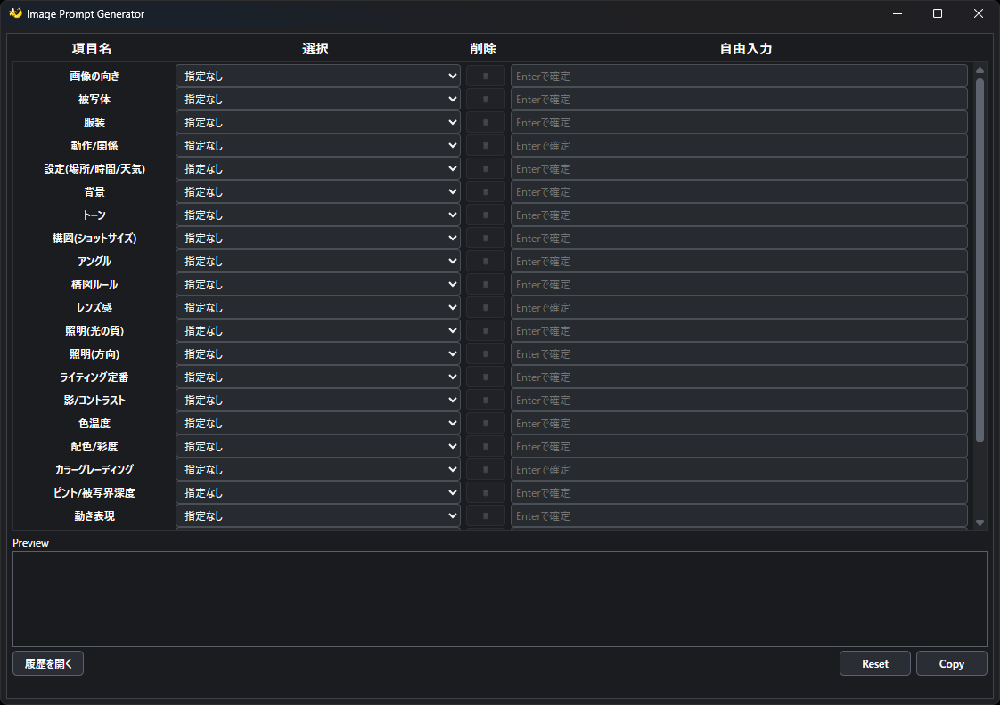
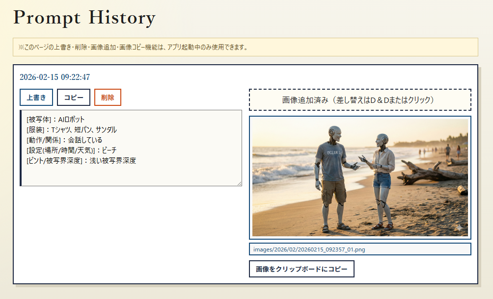

# Image Prompt Generator

選択肢から画像生成用プロンプトを生成し、コピーと履歴管理を行うWindows向けデスクトップアプリです。  
配布ターゲットは単一EXEです。

## Screenshots
### メイン画面


項目ごとの選択・自由入力・削除を行いながら、生成されたプロンプトをリアルタイムで確認し、`Copy` でクリップボードへコピーできます。

### 履歴画面


履歴一覧からプロンプトのコピー/上書き/削除、画像の追加、画像のクリップボードコピーを行えます。  
`config.txt`の`history_max_entries`で設定した件数を超えるとアーカイブページが自動生成されます。  
アーカイブページ（`History_YYYYMMDD.html`）でも同様に削除操作が可能です。

## Requirements
- Windows 10/11
- PowerShell 5.1 または PowerShell 7
- Rust 1.85+（推奨: 最新stable、`cargo` を含む）
- Microsoft Edge WebView2 Runtime

## 初回セットアップ (PowerShell)
1. PowerShell を起動して、リポジトリのルートに移動します。
2. Rust（`cargo` 含む）をインストールします。
   - `winget install -e --id Rustlang.Rustup`
3. PowerShell を開き直し、インストールを確認します。
   - `rustc --version`
   - `cargo --version`
4. WebView2 Runtime が未導入の場合は、先に導入してください。
5. PowerShell 上でセットアップを実行します。
   - `.\setup.bat`
6. 実行結果確認のため、`setup.bat` は最後に一時停止します。

## Run (PowerShell)
1. PowerShell を起動し、リポジトリのルートに移動します。
2. `.\run.bat` を実行します。
3. 初回は `cargo build --release` が走ります。
4. `run.bat` はビルドログ表示のためコンソール（黒い画面）を使用します。

## Build (Release, PowerShell)
1. PowerShell を起動し、リポジトリのルートに移動します。
2. `.\build.bat` を実行します。
3. 出力先: `dist\ImagePromptGenerator\`
   - `ImagePromptGenerator.exe`
   - `config.txt`
4. 実行結果確認のため、`build.bat` は最後に一時停止します。
5. `ImagePromptGenerator.exe`（Release版）はコンソールを表示せず起動します。
6. アプリアイコンは `ImagePromptGenerator.exe` に埋め込まれます。

## 起動方法
- デフォルト設定ファイル（優先順）
  1. `ImagePromptGenerator.exe` と同じフォルダの `config.txt`
  2. `config\config.txt`
- 任意設定ファイル指定
  - `ImagePromptGenerator.exe --config "C:\path\to\config.txt"`
- 開発時（Debug実行）はエラーログ確認のためコンソールが表示される場合があります。

## config.txt format (TOML)
```toml
[app]
confirm_delete = false
copy_debounce_sec = 2.0
delimiter = """

"""
history_confirm_delete = true
history_max_entries = 50
history_server_port = 3000

[[sections]]
label = "Prompt"
name = "prompt"

[[sections.items]]
allow_free_text = true
choices = [
    "指定なし",
    "横長",
    "縦長",
    "正方形",
]
```

## 主な仕様
- 各行: `項目名 / 選択 / 削除 / 自由入力`
- Enterで自由入力を確定
- 新規語は `choices` に自動追加され、`config.txt` に保存
- 削除ボタンで選択中語を `choices` から削除して保存
- プレビューはリアルタイム更新（改行区切り）
- `Copy` でクリップボードコピー + 履歴追記
- 同一プロンプトの連打コピーは `copy_debounce_sec` 秒以内なら無視
- `History.html` を外部ブラウザで表示
- `History.html` / `History_YYYYMMDD.html` で コピー / 上書き / 削除 / 画像追加（D&Dまたはファイル選択） / 画像をクリップボードにコピー
- 履歴ページ（通常/アーカイブ）の上書き・削除・画像追加・画像コピーはアプリ起動中のみ使用可能
- 画像保存先: `images/YYYY/MM/`
- 各履歴に紐づく画像は常に1件（再アップロードで差し替え）
- `history_max_entries` 超過時に `History_YYYYMMDD.json/html` へ自動アーカイブ
- 最後の選択内容は `config.txt` に保存され、再起動後に復元
- `Reset` ボタンで選択内容を全リセット

## 互換性
以下の既存ファイルは同形式を維持します。
- `config.txt`
- `history.json`
- `History_YYYYMMDD.json`
- `History.html`
- `History_YYYYMMDD.html`
- `images/YYYY/MM/*`

## Project Layout
```text
.
├─ Cargo.toml
├─ rust/
│  └─ src/
│     ├─ main.rs
│     ├─ windows_app.rs
│     ├─ server.rs
│     ├─ history_store.rs
│     ├─ config_store.rs
│     ├─ renderer.rs
│     ├─ path_utils.rs
│     └─ main_ui_html.rs
├─ config/
│  └─ config.txt
├─ build.bat
├─ run.bat
└─ setup.bat
```

## Size Optimization
`Cargo.toml` の `release` プロファイルで以下を有効化しています。
- `opt-level = "z"`
- `lto = "fat"`
- `codegen-units = 1`
- `panic = "abort"`
- `strip = true`

## Known Limitations
- 実行対象はWindowsのみ
- WebView2 Runtime未導入環境では起動できません
- `negative prompt` は未対応
